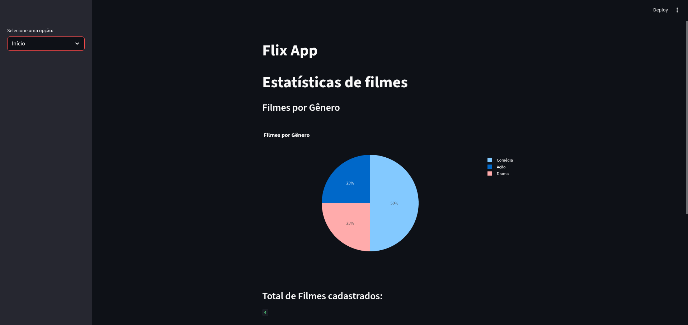

# Flix App

Aplicação Streamlit para gerenciar filmes, gêneros, atores e avaliações.

**Descrição**
- Interface em Streamlit que consome uma API externa para armazenar e recuperar dados de filmes.
- Repositório da API: https://github.com/ChristianGCa/flix_api

**Como executar**
1. Crie e ative um ambiente virtual:

```bash
python -m venv venv
source venv/bin/activate
```

2. Instale dependências:

```bash
pip install -r requirements.txt
```

3. Execute a aplicação:

```bash
streamlit run app.py
```

**Imagens**
- Exemplos da interface:


